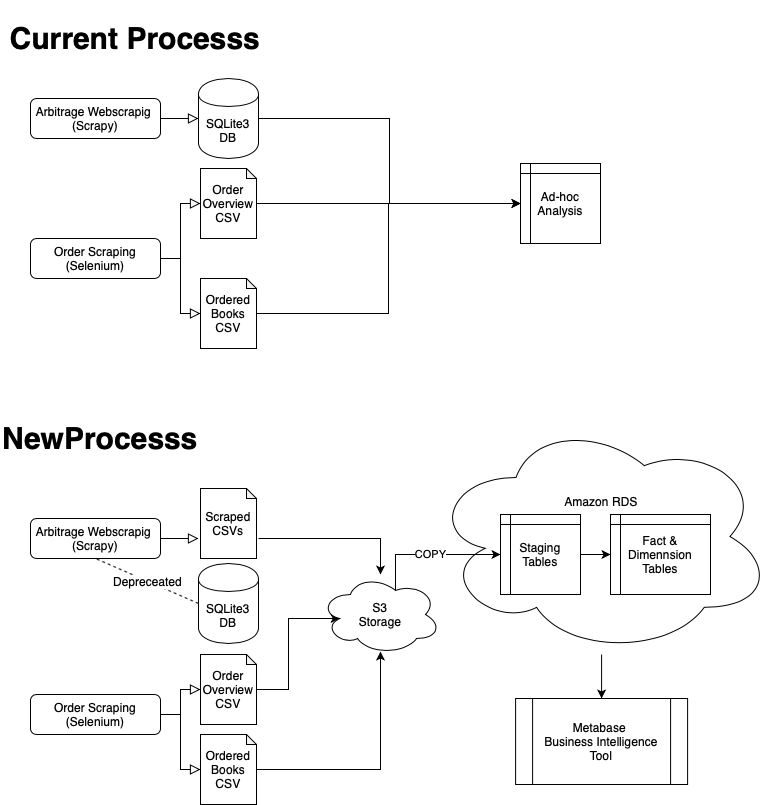
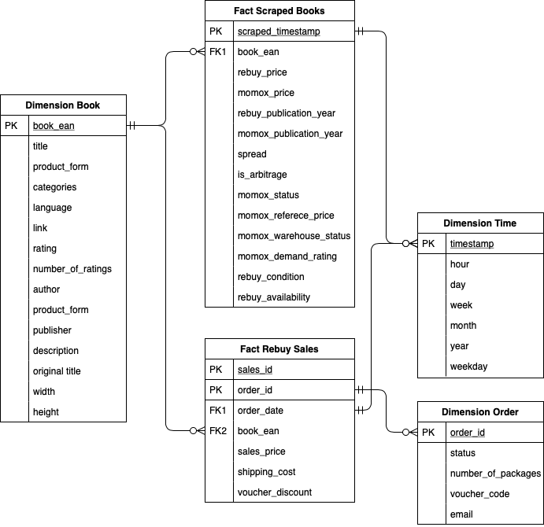
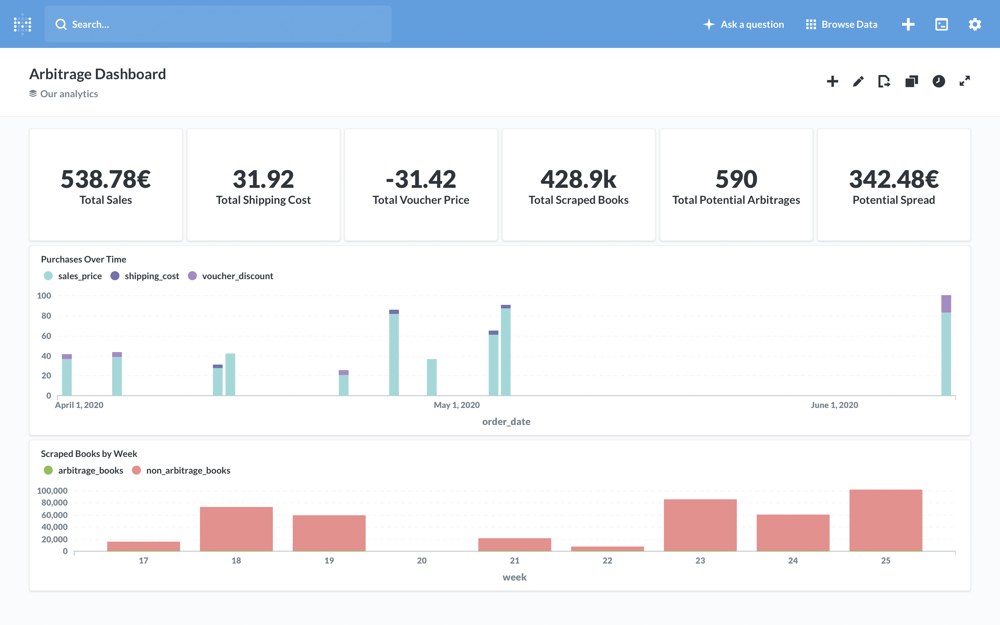

# Udacity Data Engineering Capstone Project


##  Scope of the Project

The scope of the project is to automate the ETL process and data flow of my personal arbitrage project to provide a better and more struectured data source for analysis. 

On a continously basis two websites are scraped and prices are compared. Once a certain threshold is reached an abitrage process takes place to realize revenue from the price differences.

### Current vs. new Process

#### The current process has the following problems:

- Data flow process not automated
- Files and data live on local machine making it hard to share and unsafe in case of data loss
- Files have to be manually merged to generate new insights
- No automated dashboards or reports possible

#### The new process solves the before mentioned problems the following way:

- ETL pipeline automated through python scripts
- Creation of Star Schema Model with Fact and Dimension Tables to facilitate analysis
- Bigger Picture view of all datasets and scraped data as well as sales through using Metabase (Open Source BI Tool)



## Data Model

1) Sales (also future book scarpes) are scraped from the website and uploaded to S3.
2) S3 is exported to staging tables in Postgres
3) Staging Tables are transformed to the following tables:
    - 2 fact tables: 
        - Fact Scraped Books
        - Fact Rebuy Sales
    - 3 Dimension tables:
        - Dimension Book
        - Dimension Order
        - Dimension Time

To better and more easily understand the data structure, the following model shows the relationships among the tables:



## BI Application and Real Life Usage



## Future Improvements and other Scenarios

### 1) Increase in data size

Before the course all the data was locally saved in a SQLlite3 database. This storage is not ideal for the future demands of the project, since it is hard to export data in smaller chunks and also backfill data if there are changes.

A more suitable approach would be to break up the data into smaller csv files that get safely and easily stored on S3. This approach will replace the current local SQLlit3 databsae with a better performing file upload to S3.

### 2) Pipelines are run on a daily basis

In this project the code needs to be manually executed. A first improvement could be to schedule the pipelines with Cron jobs. However, the best improvement for future scenario would be to set up airflow with Dags that ensure a performant and scalable etl pipeline.

### 3) The database needed to be accessed by 100+ people

Since I wanted to develop and work on a real life use case that has practical benefits for me I chose to tackle my own project. The data is relatively small and only me and my brother need to have access to the data points. Therfore, I opted for the cheaper and less faster solution of setting up a Postgres RDS instance on AWS.

If the project gets bigger and more users are needed Redshift on AWS might be a very good option.

### How to run the script

Please note that in order to run the ETL pipeline you will need **AWS credentials and access to the data warehouse** which are stored in `dwh.cfg` and not shared on GitHub.

Furthermore the **SQLlite3 legacy database** is too large to be uploaded on GitHub, as previously mentioned this database will be depreceated and broken up into smaller files on S3. for this reason the part of the code has been commented out.

1. Clone the repository and create a virtual environment
```
python3 -m venv env

```

2. Install the requirements with pip
```
pip install -r requirments.txt

```

3. Rename the `dwh_template.cfg` to `dwh.cfg` and fill in the secrets.

4. Execute the etl pipeline by running the following comand in your terminal: 
```
python3 etl.py
```

### Files in the repository

1. `etl.py` script that processes data into previously created table
3. `sql_queries.py` script with all sql queries used for dropping, creating tables and inserting data
3. `dwh_template.cfg` a template configuration file where the right credentials need to be filled ind.